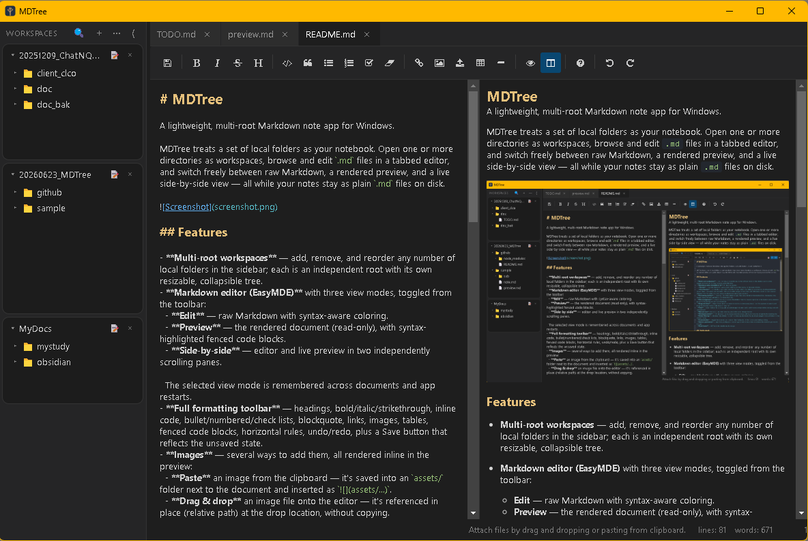

# MDTree

A lightweight, multi-root Markdown note app for Windows.

MDTree treats a set of local folders as your notebook. Open one or more directories as workspaces, browse and edit `.md` files in a tabbed editor, and switch freely between raw Markdown, a rendered preview, and a live side-by-side view — all while your notes stay as plain `.md` files on disk.



## Features

- **Tiny footprint** — a single portable `.exe`, about **3.9 MB**, no installer and no background services. Copy it anywhere and run it.
- **Multi-root workspaces** — add, remove, and reorder any number of local folders in the sidebar; each is an independent root with its own resizable, collapsible tree.
- **Markdown editor** with three view modes, toggled from the toolbar:
  - **Edit** — raw Markdown with syntax-aware coloring.
  - **Preview** — the rendered document (read-only), with syntax-highlighted fenced code blocks.
  - **Side-by-side** — editor and live preview in two independently scrolling panes.

  The selected view mode is remembered across documents and app restarts.
- **Full formatting toolbar** — headings, bold/italic/strikethrough, inline code, bullet/numbered/check lists, blockquote, links, images, tables, fenced code blocks, horizontal rules, plus a Save button that reflects the unsaved state.
- **Images** — several ways to add them, all rendered inline in the preview:
  - **Paste** an image from the clipboard — it's saved into an `assets/` folder next to the document and inserted as ``.
  - **Drag & drop** an image file onto the editor — it's referenced in place (relative path) at the drop location, without copying.
  - **Insert from the toolbar** — pick a local image file to reference.
- **Syntax highlighting** — fenced code blocks are highlighted in the preview.
- **File management** — create, rename, and delete files/folders from the sidebar (right-click or the toolbar icons); deletions go to the Recycle Bin, not permanent removal.
- **Drag and drop** — drop a folder onto the sidebar to add it as a workspace, drop a `.md` file anywhere to open it, and drag files between folders in the tree to move them.
- **Tabs** — open multiple files at once, with unsaved-change indicators, middle-click (or ×) to close, and a confirmation prompt before closing a tab with unsaved edits.
- **Manual save** (`Ctrl+S`) — no silent autosave; you control when changes hit disk.
- **Workspace search** — full-text search across every open workspace, with results that jump straight to the matching line.
- **Folder filtering** — the tree hides folders that contain no Markdown files by default (toggle "show all folders" in the sidebar menu).
- **Customizable** — set a custom font family and size from the Settings dialog.
- **Portable settings** — your session (open tabs, workspaces, layout) and preferences are saved right next to the `.exe`, so they travel with it.
- **Dark theme** — MDTree is dark-mode only by design.

## Download

MDTree ships as a single portable executable — no installation, no admin rights, no bundled runtime bloat.

```sh
git clone https://github.com/kuimoani/mdtree.git
cd mdtree
pnpm install
pnpm run build
```

The finished executable is written to `src-tauri/target/release/mdtree.exe`. Copy it wherever you like and run it.

> **Note:** this project currently targets **Windows only**.

## License

MIT

## Changelog

### v0.3.0
- Rebuilt on **Tauri v2** in place of Electron — the packaged app shrank from an ~82 MB installer to a **~3.9 MB portable executable**, with no separate install step.
- Settings and session are now stored next to the executable by default, so the whole app is self-contained and portable.
- Removed the Undo/Redo toolbar buttons (the usual `Ctrl+Z` / `Ctrl+Y` shortcuts still work).

### v0.2.0
- Switched the editor engine to EasyMDE, with syntax highlighting for fenced code blocks.
- Added image support: paste from clipboard, drag & drop, and insert-from-toolbar, all rendered inline in the preview.
- The last-used view mode (edit / preview / side-by-side) is now remembered across restarts.
- Broken preview images now show a clear placeholder instead of rendering nothing.
- Added a Windows zip distribution alongside the installer.

### v0.1.0
- Initial release: multi-root workspace sidebar, tabbed editor with a live Markdown preview, table rendering, and manual save with unsaved-change indicators.
